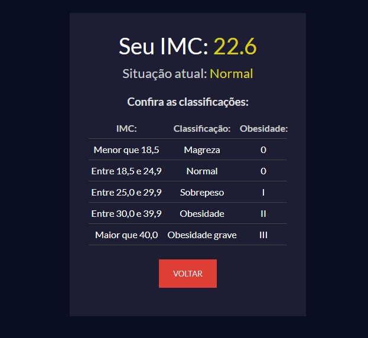

<h1 align="center">Calculadora de IMC 🧮</h1>

<p align="center">
  
  
</p>

<p align="center">
  Uma calculadora de IMC (Índice de Massa Corporal) feita com React.js e Vite. Ideal para praticar conceitos como <b>componentização</b>, <b>estados</b> e <b>eventos</b>.
</p>

---

## 📸 Preview

<div align="center" style="display: flex; gap: 20px; justify-content: center;">
  
  
</div>

---

## 🚀 Tecnologias utilizadas

- ✅ React.js (com Vite)

---

## 📐 Funcionalidades

- ✅ Campo para inserir peso (em kg)
- ✅ Campo para inserir altura (em metros)
- ✅ Botão para calcular o IMC
- ✅ Botão para limpar os dados
- ✅ Resultado com a classificação (abaixo do peso, normal, sobrepeso, etc)

---

## 🧠 Lógica do IMC

A fórmula utilizada é: IMC = peso / (altura * altura)


## 🛠️ Como executar o projeto localmente

Siga os passos abaixo para rodar a calculadora de IMC no seu computador:


```bash
# Clone o repositório
git clone https://github.com/klayver-dev/calculadora-de-imc.git

# Entre na pasta do projeto
cd calculadora-de-imc

# Instale as dependências
npm install

# Inicie o servidor de desenvolvimento
npm run dev

# Para criar a versão de produção use:
npm run build
